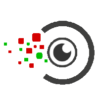

# Nicholas Moratelli, PhD Student @ AImageLab 
## About Me 

🤖 I’m @NicholasMoratelli, a Ph.D. Student under the supervision of Prof. Rita Cucchiara at AImageLab (UNIMORE).

👀 My research primarily focuses on Multimodal Large Language Models, Vision and Language, and Foundation Models. My research is driven by a deep interest in Generative AI and HPC systems. I leverage advanced AI technologies to lead innovative solutions, tackling both emerging and enduring challenges with adaptability and expertise.

## Research Topics 🔭
- Multimodal Large Language Models (MLLM)
- Vision and Language (V&L)
- Vision Foundation Models
- Retrieval Augmented Generation (RAG)
- Compositional AI
- Modular Deep Learning, Parameter Efficient Fine-tuning

## Contact Information 📫
- Email: nicholas.moratelli@unimore.it
- Linkedin: https://www.linkedin.com/in/nicholas-moratelli-12326823
- Google Scholar: https://scholar.google.com/citations?user=8YkdgNkAAAAJ

<!--
**NicholasMoratelli/NicholasMoratelli** is a ✨ _special_ ✨ repository because its `README.md` (this file) appears on your GitHub profile.

Here are some ideas to get you started:

- 🔭 I’m currently working on ...
- 🌱 I’m currently learning ...
- 👯 I’m looking to collaborate on ...
- 🤔 I’m looking for help with ...
- 💬 Ask me about ...
- 📫 How to reach me: ...
- 😄 Pronouns: ...
- ⚡ Fun fact: ...
-->
